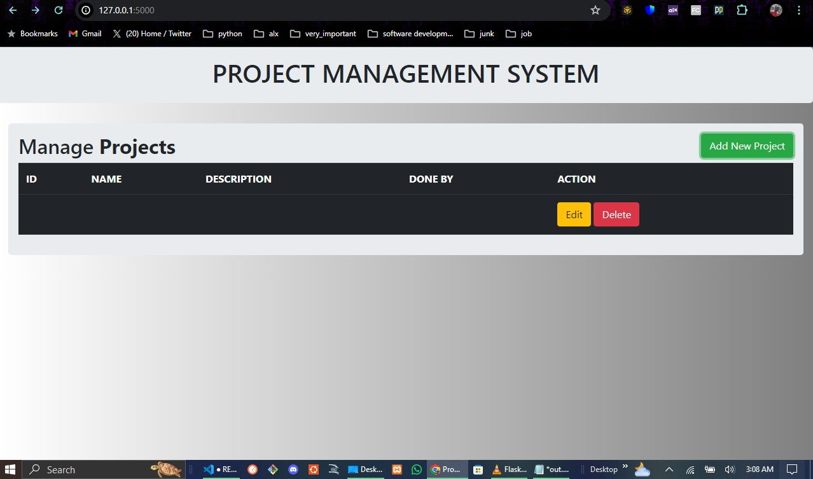
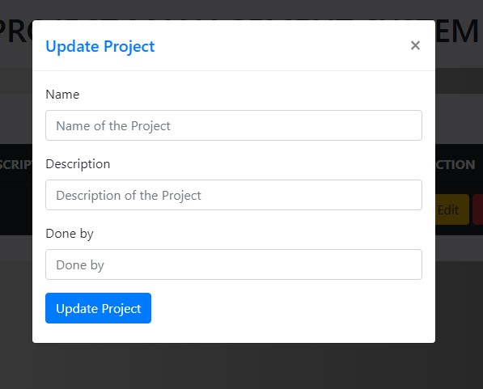
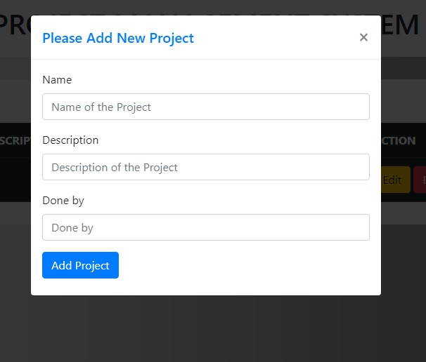

## PROMASYS - PROJECT MANAGEMENT SYSTEM

Project Management Flask Web Application

Table of Contents

Introduction

Features

Installation

Configuration

Usage

Project Structure

Dependencies

Testing

Contributing

License

Contact

# Introduction
The Project Management System is a Flask Web Application designed to help teams manage projects efficiently. It provides tools for task assignment, task creation,update and Delete.

## Features

Project Creation: Create and manage multiple projects.

Task Management: Assign tasks to team members

## Installation
Follow these steps to set up the project locally.

## Prerequisites

Python 3.x

pip

Virtualenv (recommended)

Steps
## Clone the repository

git clone https://github.com/michaeljumah/PROMASYS.git

cd ROMASYS

## Create and activate a virtual environment

python -m venv venv

source venv/bin/activate  # On Windows use `venv\Scripts\activate`

## Install dependencies

pip install -r requirements.txt

### Set up the database

flask db init

flask db migrate -m "Initial migration."

flask db upgrade

## Run the application

python pro.py

## Configuration
Configuration settings are stored in config.py. Adjust the settings as needed, especially the database URI, secret key, and any other environment-specific variables.

python

Copy code

import os

class Config:

    SECRET_KEY = os.environ.get('SECRET_KEY') or 'your_secret_key'

    SQLALCHEMY_DATABASE_URI = os.environ.get('DATABASE_URL') or 'sqlite:///site.db'

    SQLALCHEMY_TRACK_MODIFICATIONS = False

## Usage
Once the application is running, open a web browser and go to http://127.0.0.1:5000/ to access the application. Register a new user or log in with an existing account to start managing projects.

## Screenshots

Interface for managing tasks within a project.

## Project Structure

The project structure follows the standard Flask application format.

PROMASYS/
│
├── app/
│   ├── __init__.py
│   ├── routes.py
│   ├── models.py
│   ├── templates/
│   ├── static/
│   └── forms.py
│
├── migrations/
│
├── tests/
│
├── venv/
│
├── config.py
├── requirements.txt
├── run.py
└── README.md

## Dependencies
The main dependencies for this project are listed in requirements.txt.

Flask==2.0.2

Flask-SQLAlchemy==2.5.1

## Testing

To run the tests, use the following command:

pytest

Ensure that the testing framework pytest is installed in your virtual environment.

## Contributing

Contributions are welcome! Please fork the repository and submit a pull request with your changes. Ensure that your code adheres to the project's coding standards and includes appropriate tests.

## License

See the LICENSE file for more information.

## Contact

For any questions or inquiries, please contact https://github.com/michaeljumah.

twitter: https://twitter.com/MichaelDenver8

github: https://github.com/michaeljumah.

## Creating a new brunch to work on separetly

cd path/to/your/repository

git fetch origin

git checkout -b new-feature

git push origin new-feature

This process will create a new branch in your local repository, switch to it, and then push it to GitHub. The branch will now be available in your remote repository on GitHub.

## ISSUES TO TACKLE IN THE FUTURE

User Authentication: Secure login and registration system.

set deadlines, and track progress.

Collaboration Tools: Comment on tasks, share files, and receive notifications.

Dashboard: Overview of all projects and tasks with status indicators.